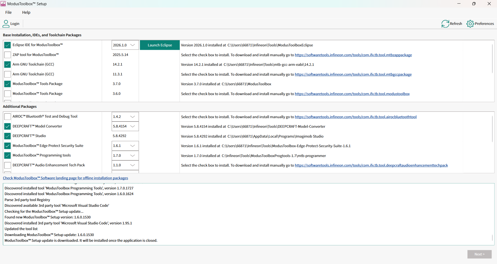
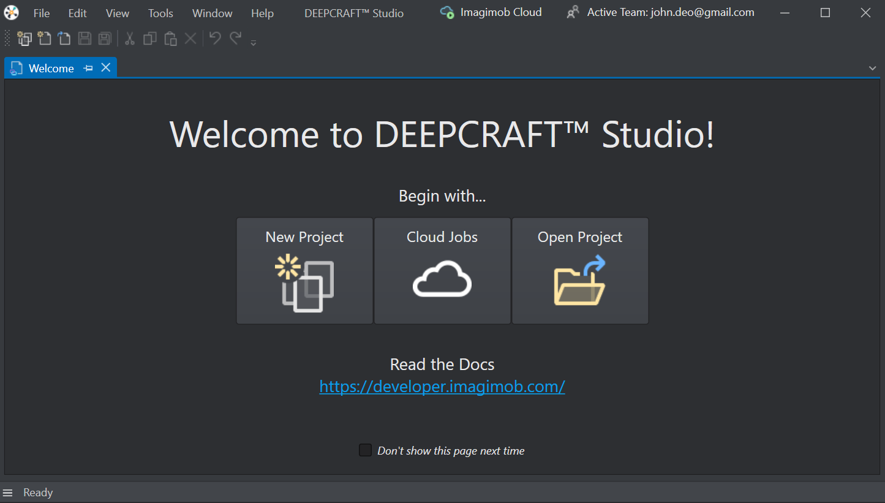

#  Custom Object Detection model with DEEPCRAFT Studio and Modustoolbox
A Hands-On Tutorial for generating custom models on an embedded board

#  Related resources

Resources  | Links
-----------|----------------------------------
Device documentation | [PSOC&trade; Edge MCU datasheets](https://www.infineon.com/products/microcontroller/32-bit-psoc-arm-cortex/32-bit-psoc-edge-arm#documents)   [PSOC&trade; Edge MCU reference manuals](https://www.infineon.com/products/microcontroller/32-bit-psoc-arm-cortex/32-bit-psoc-edge-arm#documents)
Development kits | [PSOC&trade; Edge E84 Evaluation Kit](https://www.infineon.com/KIT_PSE84_EVAL)   [PSOC&trade; Edge E84 AI Kit](https://www.infineon.com/KIT_PSE84_AI)
Libraries  | [mtb-dsl-pse8xxgp](https://github.com/Infineon/mtb-dsl-pse8xxgp) – Device support library for PSE8XXGP   [retarget-io](https://github.com/Infineon/retarget-io) – UART debug output   [abstraction-rtos](https://github.com/Infineon/abstraction-rtos) – FreeRTOS abstraction layer
Tools  | [ModusToolbox&trade;](https://www.infineon.com/modustoolbox) – ModusToolbox&trade; software is a collection of easy-to-use libraries and tools enabling rapid development with Infineon MCUs   [VSCODE;](https://code.visualstudio.com/) - The open source AI code editor

# Software setup

See [the ModusToolbox™ tools package installation guide](https://www.infineon.com/assets/row/public/documents/30/68/infineon-modustoolbox-software-installation-guide-gettingstarted-en.pdf) for information about installing and configuring the tools package.

Install a terminal emulator if you do not have one. Instructions in this document use [Tera Term](https://teratermproject.github.io/index-en.html).

Required libraries (fetched automatically via make getlibs):

retarget-io v1.9.0 – UART debug output
FreeRTOS v10.6.202 – Real-time operating system
MTB HAL – Hardware abstraction layer

# Supported kits (make variable 'TARGET')

- [PSOC&trade; Edge E84 Evaluation Kit](https://www.infineon.com/KIT_PSE84_EVAL) (`KIT_PSE84_EVAL_EPC2`) – Default value of `TARGET` (tested)
- [PSOC&trade; Edge E84 Evaluation Kit](https://www.infineon.com/KIT_PSE84_EVAL) (`KIT_PSE84_EVAL_EPC4`)
- [PSOC&trade; Edge E84 AI Kit](https://www.infineon.com/KIT_PSE84_AI) (`KIT_PSE84_AI`)

# Learning Outcomes
1. Learn and understand how to create and use tools with ModusToolbox and DEEPCRAFT Studio.
2. Understand the principles of building AI models using DEEPCRAFT Studio.
3. Be able to build custom AI models on DEEPCRAFT Studio.
4. Be able to deploy custom models to hardware boards and execute on-device inference using DEEPCRAFT Studio.

#  Steps
1. ModusToolbox&trade; and DEEPCRAFT Studio installation
2. AI Model creation on DEEPCRAFT Studio
3. Code generatation for porting a model to the board
4. Build and deploy a model to the board

## Step 1: ModusToolbox&trade; and DEEPCRAFT Studio installation

link to download ModusToolbox&trade; and DEEPCRAFT Studio
Resources  | Links
-----------|----------------------------------
ModusToolbox&trade; | [Link;](https://www.infineon.com/design-resources/development-tools/sdk/modustoolbox-software?uid=ci44510001&aid=ai4451&gclsrc=aw.ds&gad_source=1&gad_campaignid=21544549833&gbraid=0AAAAADpmf9eCeVKpUbj7qFToHJWQoXqjv&gclid=CjwKCAiAkbbMBhB2EiwANbxtbUcjLVxQyMXbMPO-9CEml5x8BNMwZ_sYdUzpfT8vvO2c3bHPpmn71RoCUbsQAvD_BwE)
DEEPCRAFT Studio | [Link;](https://developer.imagimob.com/deepcraft-studio/install-download-studio)

**Figure 1:** ModusToolbox development environment for embedded system application design.

**Figure 2:** DEEPCRAFT Studio interface for AI model creation, training, and deployment.